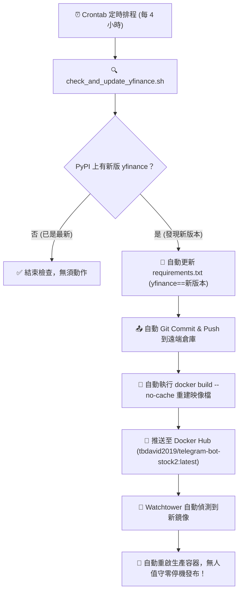

# 🤖 Telegram 股票資訊與 AI 投資分析機器人 (`telegram-bot-stock2`)

這是一個基於 Python 與 `python-telegram-bot` 開發的高效能 **Telegram 股票與 AI 投資分析機器人**。提供即時台股/美股行情、多週期 K 線圖、Prophet 股價預測、基本面技術面評估，以及強大的 **14 位投資大師 AI 對沖基金委員會與圓桌會議辯論**。

---

## 📸 功能展示


---

## 🌟 核心功能一覽

### 1. 💬 智能金融助理自由對話（直接傳送文字）
- **對話記憶 (Memory)**：具備對話記憶能力，支援自然語言連續追問與多輪討論。
- **即時工具動態調用**：在對話中動態查詢最新即時股價、技術指標（RSI/MACD/VWAP）、公司基本面財務比率（P/E、營收成長率、毛利率等）、即時新聞以及 **2MD 全網連網即時檢索**。
- **David888 Wiki 智能發布 (`publish_to_wiki`)**：當生成長篇深度分析報告、多股橫向對比或使用者要求分享連結時，Agent 自動調用執行器將報告發布至 [David888 Wiki](https://wiki.david888.com)（支援 `[TOC]` 目錄、美化主題、表格與註腳）並回傳專屬 `shareUrl`。
- **零幻覺保證**：嚴格實時聯網驗證公司上市/IPO 狀態、代號與即時消息，杜絕模型幻覺。
- **重置記憶**：輸入 `/start` 即可重置對話上下文。

### 2. 🏛️ AI 對沖基金投資委員會 (`/ai2 股票代碼`)
- **14 位傳奇投資大師與專家 Persona**：
  - 👴 **巴菲特** (護城河/內在價值)、🧓 **蒙格** (定價權/逆向思維)、📚 **葛拉漢** (淨流動資產/深價值)、👩‍💼 **伍德** (破壞性創新)、🦈 **艾克曼** (催化劑/積極主義)、🏛️ **裴洛西** (國會交易揭露)、👁️ **貝瑞** (反向放空/隱性負債)、🛍️ **林區** (十倍股/生活選股)、🔍 **費雪** (15項質化調查)、🦍 **WSB** (散戶熱度/軋空)、📉 **技術分析師**、📈 **基本面分析師**、🌐 **情緒分析師**、⚖️ **估值分析師**。
- **圓桌辯論 (Round Table Debate)**：大師們就「成長 vs 估值」展開激烈多輪辯論，產出委員會共識 (`Consensus`) 與分歧觀點 (`Dissenting Opinions`)。
- **配置建議與 Wiki 報告**：輸出最終操作決策（買入 / 賣出 / 做空 / 持有）、建議股數與信心度評分，並**自動在背景發布完整大師論述至 David888 Wiki**，隨附一鍵網頁閱讀連結。

### 3. 📈 即時股價與 K 線圖 (`/s 股票代碼`)
- 查詢即時最新成交價、開高低收、成交量，並由背景線程自動繪製產生 **日K、週K、月K 線圖**。
- 支援美股（例如 `TSLA`、`NVDA`、`AAPL`）與台股（例如 `2330.TW`、`2002.TW`、`0050.TW`）。

### 4. 🔮 Prophet 股價時間序列預測 (`/p 股票代碼`)
- 採用 Facebook Prophet 模型預測未來 5 個交易日之價格趨勢走勢圖與信賴區間數據。

### 5. 📰 即時美股、台股與重大盤中快訊 (`/n` / `/ny` / `/hot`)
- `/n 股票代碼`：查詢美股最新即時英文財經新聞。
- `/ny 股票代碼`：查詢 Yahoo 台灣最新即時中文新聞。
- `/hot [cls|wallstreetcn|xueqiu]`：即時抓取 **財聯社 (CLS 盤中快訊)**、**華爾街見聞 (全球宏觀)** 或 **雪球 (熱門討論榜)** 頭條。

### 6. ⛓️ 金融邏輯傳導鏈分析 (`/chain 事件或主題`)
- 整合 **DeepEar Lite** 即時市場信號與傳導鏈推導引擎。
- 面對宏觀政策（如降息）、地緣政治、產業異動，自動拆解三級因果：
  1. 一級直接衝擊 (利率/匯率/原物料)
  2. 二級產業鏈成本轉嫁與庫存週期
  3. 三級受惠與受害台美股標的 (包含具體代號如 `2330.TW`, `NVDA`)
  4. 邏輯證偽條件與 **Mermaid 因果流程圖** 視覺化輸出。

### 7. 📐 量化研究與 Fama-French 多因子模型 (`/ff` / `/sepa` / `/val` / `/earn` / `/corr`)
- `/ff 股票代碼`：**Fama-French 多因子模型風險歸因**，計算市場 Beta ($\beta_{mkt}$)、市值 Size ($\beta_{SMB}$)、估值 Value ($\beta_{HML}$)、動能 Momentum ($\beta_{UMD}$) 及年化選股超額報酬 Alpha ($\alpha$) 與 Adj. $R^2$。
- `/sepa 股票代碼`：以 50/150/200 日均線、52 週高低點與 SPY 相對強度檢查 Minervini 8 項 SEPA Trend Template，並提供 pivot、風險停損與 VCP 收縮診斷。
- `/val 股票代碼`：以最新 `^TNX` 10 年期美債殖利率建立 WACC，投射五年 FCFF，輸出 Bull/Base/Bear 公允價與 WACC/終值成長敏感度矩陣。負現金流公司會明確降級為 P/S 或 EV/Revenue 參考。
- `/earn 股票代碼`：整理下一次財報日期、EPS/營收共識、分析師目標價與最近四季 beat/miss 驚喜紀錄。
- `/corr 股票1,股票2,...`：以最近 90 個交易日計算 2 至 5 檔股票的日報酬相關矩陣及相對 SPY Beta。

### 8. 🏢 台股三大法人籌碼分析 (`/chip 股票代碼`)
- **官方 API 直連**：串接台灣證券交易所 (**TWSE T86** 買賣超明細報表、**MI_QFIIS** 外資持股統計) 與證券櫃檯買賣中心 (**TPEX 3itrade** 上櫃三大法人)。
- **精確到張數**：外資（含陸資）、投信、自營商（自行買賣與避險）精確買賣超張數與三大法人合計。
- **連買連賣指標**：自動計算外資與投信連續買超或賣超天數（連買天數、連賣天數），快速識別法人認養股。
- **累計買賣超與外資持股**：近 5 日、10 日、20 日累計買賣超張數，以及外資總持股比例 (%) 變化。
- **多執行緒與本地磁碟快取**：內建 `data/cache/institutional/` 磁碟快取與 `ThreadPoolExecutor` 平行擷取，毫秒級極速回傳。

### 9. 🧭 Smart Money 與散戶市場情報（自然語言調用）
- 13F：透過 2MD 三節點備援讀取 Dataroma/WhaleWisdom 公開資料，整理超級投資人買入、賣出或持有摘錄。
- Form 4：透過 2MD 讀取 OpenInsider、Finviz/SEC 公開頁面，區分公開市場買賣與 option/grant。
- Short squeeze：整合 yfinance short float、days to cover 與 2MD 借券費率摘錄。
- Retail sentiment：以 2MD SERP 掃描 Reddit WallStreetBets 與 StockTwits 提及、方向與催化劑摘錄。

以上情報工具可直接用自然語言提問，例如「整理 TSLA 最近的 13F 與內部人交易」或「分析 GME 的 short squeeze 風險」。搜尋結果不足時會保留資料限制，不以猜測補值。

### 10. 🛠️ 其他量化工具連結 (`/h`)
- 提供台股 LSTM 預測、潛力股預測模型與 HuggingFace 空間快速入口。

---

## ⌨️ 指令速查表 (Command Reference)

| 指令 | 說明 | 範例 |
| :--- | :--- | :--- |
| **直接傳送文字** | 💬 智能金融助理自由問答 (整合量化模型、2MD 全網情報、傳導鏈、快訊、三大法人籌碼、Fama-French 與 Wiki 發布) | `分析 2330.TW 基本面與技術指標` 或 `台積電 2330 最近投信連買幾天？` |
| `/start` | 🔄 啟動機器人並重置對話記憶 | `/start` |
| `/new` / `/clear` | 🧹 手動清空對話記憶開啟全新對話 (3 天無互動自動重置) | `/new` 或 `/clear` |
| `/chain` | ⛓️ 金融邏輯傳導鏈分析與因果流程圖 | `/chain 聯準會降息` 或 `/chain 輝達財報` |
| `/hot` | 🔥 財聯社/華爾街見聞/雪球即時快訊 | `/hot` 或 `/hot wallstreetcn` |
| `/chip` | 🏢 台股三大法人買賣超、連買連賣與外資持股 | `/chip 2330.TW` 或 `/chip 3293.TWO` |
| `/ff` | 📊 Fama-French 多因子風險歸因與 Alpha | `/ff NVDA` 或 `/ff TSLA` |
| `/ai2` | 🏛️ 14 位投資大師 AI 委員會與圓桌辯論 (自動生成 Wiki 報告) | `/ai2 NVDA` 或 `/ai2 2330.TW` |
| `/s` | 📈 查詢即時股價與日/週/月 K 線圖 (支援 tw_stocker 零失敗備援) | `/s 2330.TW` |
| `/p` | 🔮 Prophet 模型預測未來 5 天股價區間 | `/p META` |
| `/sepa` | 📐 Minervini SEPA 8 項趨勢模板與 VCP 分析 | `/sepa TSLA` |
| `/val` | 💰 五年 DCF 內在價值、WACC 與敏感度矩陣 | `/val AAPL` |
| `/earn` | 🗓️ 財報日期、共識預估與最近四季驚喜 | `/earn NVDA` |
| `/corr` | 🔗 2-5 檔股票相關矩陣與 SPY Beta | `/corr TSLA,NVDA,AAPL` |
| `/n` | 📰 智慧檢索台美股即時財經新聞 (支援代碼與中文公司名) | `/n 2330`、`/n 台積電` 或 `/n TSLA` |
| `/ny` | 📰 智慧檢索台股即時財經新聞 (相容別名) | `/ny 2330.TW` |
| `/h` | 🛠️ 顯示其他機器學習模型與量化工具連結 | `/h` |

---

## 🏗️ 系統架構

詳細架構設計與 14 位 Persona 規範請參閱 [AGENTS.md](AGENTS.md)。

- **核心框架**：Python 3.12+ / 3.13, `python-telegram-bot` (啟用 `concurrent_updates=True` 全面非阻塞並發、`InlineKeyboardMarkup` 動態主動續問按鈕)
- **Agent 與工具鏈**：`LangGraph` (具備 `synthesizer_node` 兩階段收斂架構、3 天 72h Session TTL 記憶管理), `LangChain`
- **市場數據與自動追版**：`yfinance` (自動 GitHub Actions 每日追版 CI/CD), `voidful/tw_stocker` (台股全市場日 K 高可用備援), `matplotlib`, `prophet`, `pandas`, `ta`
- **台股官方籌碼**：台灣證交所 (**TWSE T86 / MI_QFIIS**)、櫃買中心 (**TPEX 3itrade**)、`data/cache/institutional/` 磁碟快取
- **量化與因子模型**：`voidful/us_fddk` (Fama-French 多因子模型、v25 Live Paper 資產配置基準)
- **金融邏輯與傳導鏈**：DeepEar Lite API、NewsNow API (財聯社/華爾街見聞/雪球)
- **2MD 財經即時搜尋 (Web Reader & SERP)**：
  - 主力：`https://2md.aiurl.tw/`
  - 備援 1：`https://2md.glsoft.ai/`
  - 備援 2：`https://create360.ai/`
- **David888 Wiki 發布引擎**：`https://wiki.david888.com` (支援 `claude-canvas` 主題、`[TOC]`、雙架構分享)
- **AI 對沖基金後端**：`http://dns.glsoft.ai:6000` (支援 RFC 8259 嚴格 JSON 規範與雙語輸出)

---

## 🚀 部署教學 (Deployment)

### 方式 A：使用 Docker 執行 (推薦)

1. **建立 `.env` 檔案**：
```bash
cp .env.example .env
```
編輯 `.env` 填入您的金鑰：
```env
TELEGRAM_BOT_TOKEN=your_telegram_bot_token

# AI Hedge Fund API (選填，預設為 http://dns.glsoft.ai:6000)
AI2_BASE_URL=http://dns.glsoft.ai:6000

# 2MD 搜尋引擎端點 (選填，具備三組自動切換備援)
TWOMD_PRIMARY_URL=https://2md.aiurl.tw
TWOMD_BACKUP1_URL=https://2md.glsoft.ai
TWOMD_BACKUP2_URL=https://create360.ai

# David888 Wiki 發布端點 (選填，預設為 https://wiki.david888.com)
WIKI_BASE_URL=https://wiki.david888.com

# 主對話助理 (支援 NEN DeepSeek / Groq / OpenAI 等相容端點)
LLM_API_KEY=your_llm_api_key
LLM_BASE_URL=https://nen.com.tw/v1
LLM_MODEL=deepseek-v4-flash
```

2. **使用部署腳本一鍵啟動**：
```bash
bash docker-run.sh
```

或手動執行 Docker：
```bash
docker build -t telegram-bot-stock2 .
docker run -d --name telegram-bot-stock2 --restart unless-stopped --env-file .env telegram-bot-stock2
```

---

## 🔄 yfinance 自動檢查更新與 Docker 自動重建 (Auto-Update & CI/CD)

Yahoo Finance 經常調整後端 API，導致舊版 `yfinance` 出現報價抓取失敗。本專案內建專屬的 **PyPI 即時檢查與自動化重建腳本 (`check_and_update_yfinance.sh`)**，實現自動升級與熱更新閉環。

### 📊 自動更新與 Watchtower 聯動流程圖



### 🛠️ 常用操作指令

#### 1. 執行完整自動升級流程（檢查 + 更新 requirements.txt + Push + Docker 重建與推送）：
```bash
bash check_and_update_yfinance.sh
```

#### 2. 僅檢查 PyPI 版本（不進行 Docker 建置與推送）：
```bash
SKIP_DOCKER_BUILD=1 SKIP_GIT_PUSH=1 bash check_and_update_yfinance.sh
```

#### 3. 設定 Linux / macOS Crontab 排程（每 4 小時自動執行）：
```bash
crontab -e
```
填入以下設定：
```cron
# 每 4 小時自動檢查 PyPI yfinance，若有新版自動升級、重建並發布 Docker
0 */4 * * * cd /home/bitnami/telegram-bot-stock2 && /bin/bash check_and_update_yfinance.sh >> /home/bitnami/telegram-bot-stock2/update_log.txt 2>&1
```

#### 4. 查看自動更新執行日誌：
```bash
tail -f update_log.txt
```

---

## 🔭 Watchtower 自動化運維 (無人值守自動發布)

本專案支援 **[Watchtower](https://containrrr.dev/watchtower/)** 自動化容器更新，當 Docker Hub 發布新映像檔時自動無縫重啟：

### 方式 1：使用 Docker Compose 一鍵啟動 (推薦)
```bash
docker compose up -d
```

### 方式 2：單獨啟動 Watchtower 監控容器
```bash
bash start-watchtower.sh
```

### 查看 Watchtower 監控日誌：
```bash
docker logs -f watchtower-stockbot
```

---

### 方式 C：本機 Python 執行

1. **安裝依賴套件**：
```bash
pip install -r requirements.txt
```

2. **啟動機器人**：
```bash
python main.py
```

---

## 📚 相關文件
- 架構與代理人規範：[AGENTS.md](AGENTS.md)
- 版本變更紀錄：[CHANGELOG.md](CHANGELOG.md)

---

## 📄 License
本專案採用 GPL-3.0 License 授權。
