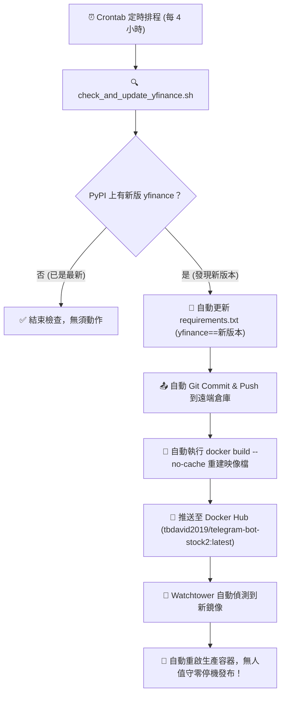

# 🤖 Telegram 股票資訊與 AI 投資分析機器人 (`telegram-bot-stock2`)

這是一個基於 Python 與 `python-telegram-bot` 開發的高效能 **Telegram 股票與 AI 投資分析機器人**。提供即時台股/美股行情、多週期 K 線圖、Prophet 股價預測、基本面技術面評估，以及強大的 **14 位投資大師 AI 對沖基金委員會與圓桌會議辯論**。

---

## 📸 功能展示


---

## 🌟 核心功能一覽

### 1. 💬 智能金融助理自由對話（直接傳送文字）
- **對話記憶 (Memory)**：具備對話記憶能力，支援自然語言連續追問與多輪討論。
- **即時工具動態調用**：在對話中動態查詢最新即時股價、技術指標（RSI/MACD/VWAP）、公司基本面財務比率（P/E、營收成長率、毛利率等）、即時新聞以及 **2MD 全網連網即時檢索**。
- **零幻覺保證**：嚴格實時聯網驗證公司上市/IPO 狀態、代號與即時消息，杜絕模型幻覺。
- **重置記憶**：輸入 `/start` 即可重置對話上下文。

### 2. 🏛️ AI 對沖基金投資委員會 (`/ai2 股票代碼`)
- **14 位傳奇投資大師與專家 Persona**：
  - 👴 **巴菲特** (護城河/內在價值)、🧓 **蒙格** (定價權/逆向思維)、📚 **葛拉漢** (淨流動資產/深價值)、👩‍💼 **伍德** (破壞性創新)、🦈 **艾克曼** (催化劑/積極主義)、🏛️ **裴洛西** (國會交易揭露)、👁️ **貝瑞** (反向放空/隱性負債)、🛍️ **林區** (十倍股/生活選股)、🔍 **費雪** (15項質化調查)、🦍 **WSB** (散戶熱度/軋空)、📉 **技術分析師**、📈 **基本面分析師**、🌐 **情緒分析師**、⚖️ **估值分析師**。
- **圓桌辯論 (Round Table Debate)**：大師們就「成長 vs 估值」展開激烈多輪辯論，產出委員會共識 (`Consensus`) 與分歧觀點 (`Dissenting Opinions`)。
- **配置建議**：輸出最終操作決策（買入 / 賣出 / 做空 / 持有）、建議股數與信心度評分（支援中英雙語解析）。

### 3. 📈 即時股價與 K 線圖 (`/s 股票代碼`)
- 查詢即時最新成交價、開高低收、成交量，並由背景線程自動繪製產生 **日K、週K、月K 線圖**。
- 支援美股（例如 `TSLA`、`NVDA`、`AAPL`）與台股（例如 `2330.TW`、`2002.TW`、`0050.TW`）。

### 4. 🔮 Prophet 股價時間序列預測 (`/p 股票代碼`)
- 採用 Facebook Prophet 模型預測未來 5 個交易日之價格趨勢走勢圖與信賴區間數據。

### 5. 📰 即時美股與台股新聞 (`/n` / `/ny`)
- `/n 股票代碼`：查詢美股最新即時英文財經新聞。
- `/ny 股票代碼`：查詢 Yahoo 台灣最新即時中文新聞。

### 6. 🛠️ 其他量化工具連結 (`/h`)
- 提供台股 LSTM 預測、潛力股預測模型與 HuggingFace 空間快速入口。

---

## ⌨️ 指令速查表 (Command Reference)

| 指令 | 說明 | 範例 |
| :--- | :--- | :--- |
| **直接傳送文字** | 💬 智能金融助理自由問答 (整合即時行情、財務指標、新聞與 2MD 連網) | `分析 2330.TW 基本面與技術指標` 或 `SpaceX 上市了嗎？` |
| `/start` | 🔄 啟動機器人並重置對話記憶 | `/start` |
| `/ai2` | 🏛️ 14 位投資大師 AI 委員會與圓桌辯論 | `/ai2 NVDA` 或 `/ai2 2330.TW` |
| `/s` | 📈 查詢即時股價與日/週/月 K 線圖 | `/s 2330.TW` |
| `/p` | 🔮 Prophet 模型預測未來 5 天股價區間 | `/p META` |
| `/n` | 📰 查詢美股即時英文新聞 | `/n AAPL` |
| `/ny` | 📰 查詢台股即時中文新聞 | `/ny 2330.TW` |
| `/h` | 🛠️ 顯示其他機器學習模型與量化工具連結 | `/h` |

---

## 🏗️ 系統架構

詳細架構設計與 14 位 Persona 規範請參閱 [AGENTS.md](AGENTS.md)。

- **核心框架**：Python 3.12+ / 3.13, `python-telegram-bot` (啟用 `concurrent_updates=True` 全面非阻塞並發)
- **Agent 與工具鏈**：`LangGraph`, `LangChain`
- **市場數據與圖表**：`yfinance` (支援 1.6.0+ 與 MultiIndex 欄位展平), `matplotlib`, `prophet`, `pandas`, `ta`
- **2MD 財經即時搜尋 (Web Reader & SERP)**：
  - 主力：`https://2md.aiurl.tw/`
  - 備援 1：`https://2md.glsoft.ai/`
  - 備援 2：`https://create360.ai/`
- **AI 對沖基金後端**：`http://dns.glsoft.ai:6000` (支援 RFC 8259 嚴格 JSON 規範與雙語輸出)

---

## 🚀 部署教學 (Deployment)

### 方式 A：使用 Docker 執行 (推薦)

1. **建立 `.env` 檔案**：
```bash
cp .env.example .env
```
編輯 `.env` 填入您的金鑰：
```env
TELEGRAM_BOT_TOKEN=your_telegram_bot_token

# AI Hedge Fund API (選填，預設為 http://dns.glsoft.ai:6000)
AI2_BASE_URL=http://dns.glsoft.ai:6000

# 2MD 搜尋引擎端點 (選填，具備三組自動切換備援)
TWOMD_PRIMARY_URL=https://2md.aiurl.tw
TWOMD_BACKUP1_URL=https://2md.glsoft.ai
TWOMD_BACKUP2_URL=https://create360.ai

# 主對話助理 (支援 NEN DeepSeek / Groq / OpenAI 等相容端點)
LLM_API_KEY=your_llm_api_key
LLM_BASE_URL=https://nen.com.tw/v1
LLM_MODEL=deepseek-v4-flash
```

2. **使用部署腳本一鍵啟動**：
```bash
bash docker-run.sh
```

或手動執行 Docker：
```bash
docker build -t telegram-bot-stock2 .
docker run -d --name telegram-bot-stock2 --restart unless-stopped --env-file .env telegram-bot-stock2
```

---

## 🔄 yfinance 自動檢查更新與 Docker 自動重建 (Auto-Update & CI/CD)

Yahoo Finance 經常調整後端 API，導致舊版 `yfinance` 出現報價抓取失敗。本專案內建專屬的 **PyPI 即時檢查與自動化重建腳本 (`check_and_update_yfinance.sh`)**，實現自動升級與熱更新閉環。

### 📊 自動更新與 Watchtower 聯動流程圖



### 🛠️ 常用操作指令

#### 1. 執行完整自動升級流程（檢查 + 更新 requirements.txt + Push + Docker 重建與推送）：
```bash
bash check_and_update_yfinance.sh
```

#### 2. 僅檢查 PyPI 版本（不進行 Docker 建置與推送）：
```bash
SKIP_DOCKER_BUILD=1 SKIP_GIT_PUSH=1 bash check_and_update_yfinance.sh
```

#### 3. 設定 Linux / macOS Crontab 排程（每 4 小時自動執行）：
```bash
crontab -e
```
填入以下設定：
```cron
# 每 4 小時自動檢查 PyPI yfinance，若有新版自動升級、重建並發布 Docker
0 */4 * * * cd /home/bitnami/telegram-bot-stock2 && /bin/bash check_and_update_yfinance.sh >> /home/bitnami/telegram-bot-stock2/update_log.txt 2>&1
```

#### 4. 查看自動更新執行日誌：
```bash
tail -f update_log.txt
```

---

## 🔭 Watchtower 自動化運維 (無人值守自動發布)

本專案支援 **[Watchtower](https://containrrr.dev/watchtower/)** 自動化容器更新，當 Docker Hub 發布新映像檔時自動無縫重啟：

### 方式 1：使用 Docker Compose 一鍵啟動 (推薦)
```bash
docker compose up -d
```

### 方式 2：單獨啟動 Watchtower 監控容器
```bash
bash start-watchtower.sh
```

### 查看 Watchtower 監控日誌：
```bash
docker logs -f watchtower-stockbot
```

---

### 方式 C：本機 Python 執行

1. **安裝依賴套件**：
```bash
pip install -r requirements.txt
```

2. **啟動機器人**：
```bash
python main.py
```

---

## 📚 相關文件
- 架構與代理人規範：[AGENTS.md](AGENTS.md)
- 版本變更紀錄：[CHANGELOG.md](CHANGELOG.md)

---

## 📄 License
本專案採用 GPL-3.0 License 授權。